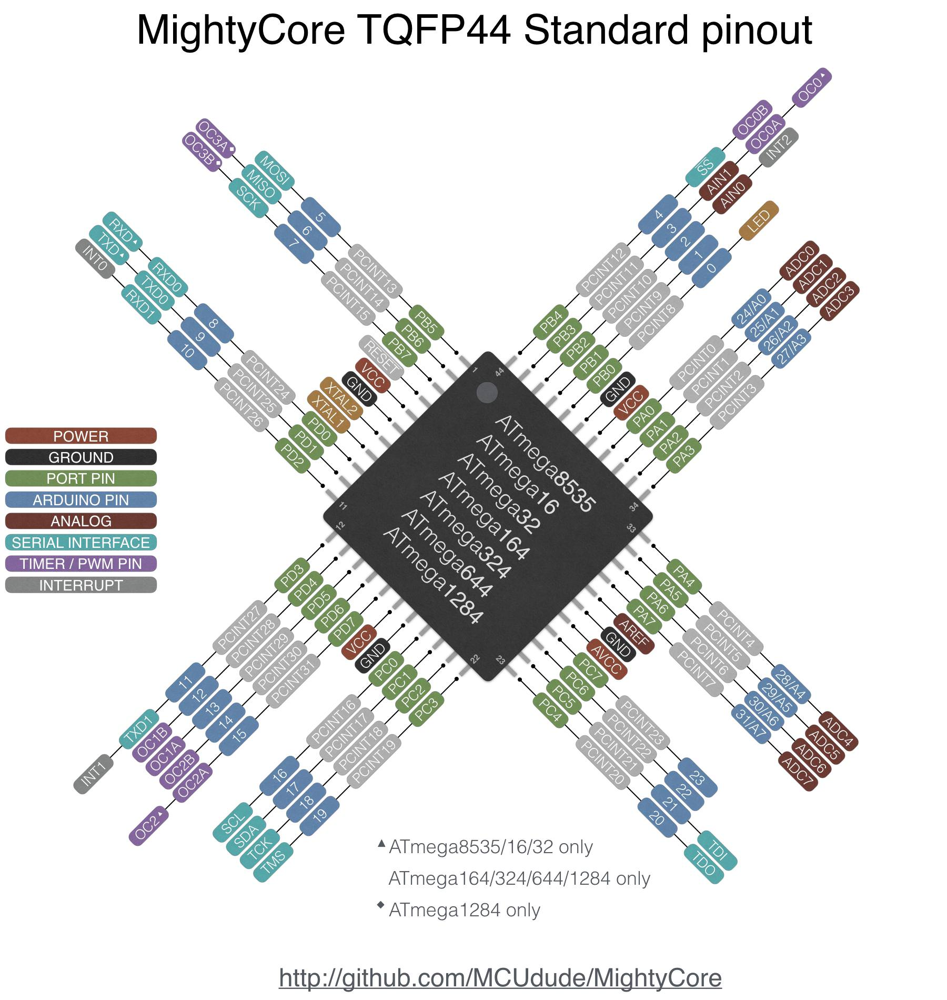

# ATMega1284 MCU based Automatic 3Phase Servo Voltage Stablizer
This Project is for Three Phase AC Power Supply

# Work In Progress!..

Arduino code & Proteus Simulation Project Included

[MightCore by MCUDude](https://github.com/MCUdude/MightyCore) is Required to compile.

THIS WILL NOT WORK WITH ARDUINO UNO/Mega2560 BOARD

Due to less I/O Pins on UNO Board

MCU: ATMega1284P (44Pin)

MCU Arduino Core: MightyCore by MCUDude //https://github.com/MCUdude/MightyCore

MCU Clock: 8Mhz (Internal Oscillator)

# MCU Fuse Bits: 

    FuseLow : 0xE2
    FuseHigh: 0x99
    For BOD 2.7v - FuseExtended: 0xFD
    For BOD 4.3v - FuseExtended: 0xFC //The one i use.

Fuses Can be Set by reading the microcontroller datasheet or from the Website: https://www.engbedded.com/fusecalc/   //Working As of 24Dec2022

# I/O Setup

WARN: This will only work with Internal Oscillator as Occillator Pins are being used as I/O.

# ATMega1284P TQFP44 Pins and I/O Diagram

# Input Voltage: 

    Phase R: PIN PA0
    Phase Y: PIN PA1
    Phase B: PIN PA2
# Output Voltage: 

    Phase R: PIN PA3
    Phase Y: PIN PA4
    Phase B: PIN PA5

# Current CT:

    ALL Phase: PIN PA6

# Input AC supply for Frequency:

    PIN PA3 //Using Same pin as Phase R Output Voltage Pin
                                                                 
# Servo Motor: 

    Phase R: Forward: PIN PB0
             Reverse: PIN PB1
    Phase Y: Forward: PIN PB2
             Reverse: PIN PB3
    Phase B: Forward: PIN PB4
             Reverse: PIN PB5

# Power Relay / Contactor Relay:

    PIN PB6                        

# UI Buttons:

    ok/Menu button: Pin PC4
    plus/Up button: Pin PC5
    minus/Down button: Pin PC6

# [Display I/O are Defined in setupDisplay() function at the end of the code.](https://github.com/saini999/004-3PH-SERVO-ATMega1284P/blob/master/004-3PH-SERVO-ATMega1284P.ino#L1078)

# Parameters

    IHu/IHv = Input High Voltage
    ILu/ILv = Input Low Voltage
    OHu/OHv = Output High Voltage
    OLu/OLv = Output Low Voltage
    SETu/SETv = Set Voltage
    OuL/OvL = Overload Current
    TOn = Relay/Contactor ON Delay
    TOff = Relay/Contactor CUTOFF Delay
    DIFF = Voltage Difference from Set Voltage

# Display Data

    NOOR: WaterMark
    R IP: R Phase Input Voltage
    R OP: R Phase Output Voltage
    Y IP: Y Phase Input Voltage
    Y OP: Y Phase Output Voltage
    B IP: B Phase Input Voltage
    B OP: B Phase Output Voltage
    LoAd: Current in AMPs
    Freq: AC Frequency of Phase R        
    
# Alarms List
    A AI: All Input Voltage Error
    A AO: All Output Voltage Error
    A rI: R Phase Input Voltage Error
    A yI: Y Phase Input Voltage Error
    A bI: B Phase Input Voltage Error
    A rO: R Phase Output Voltage Error
    A yO: Y Phase Output Voltage Error
    A bO: B Phase Output Voltage Error
